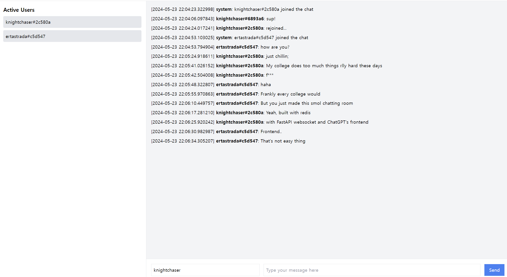

# redis-websocket-groupchat
**A small example of live chatting room with Python FastAPI + WebSocket + Redis**

### How to run
Very simple. Hit `uvicorn server:app --reload` and access to URL shown on the FastAPI console. Set your own nickname and start chatting with other users(sessions). This doesn't use cookies or something for simplicity.